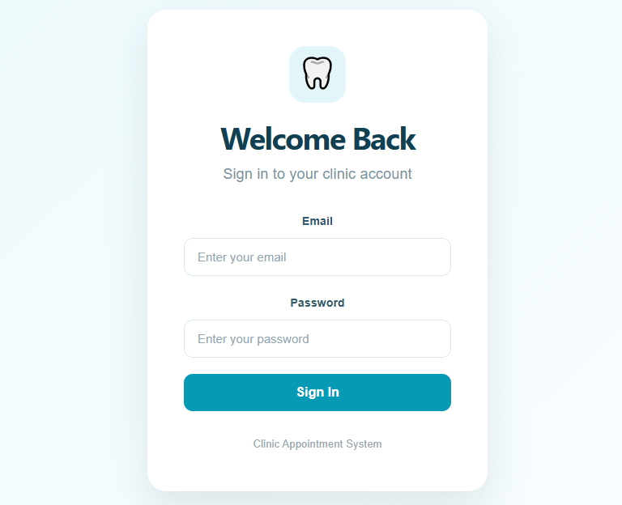
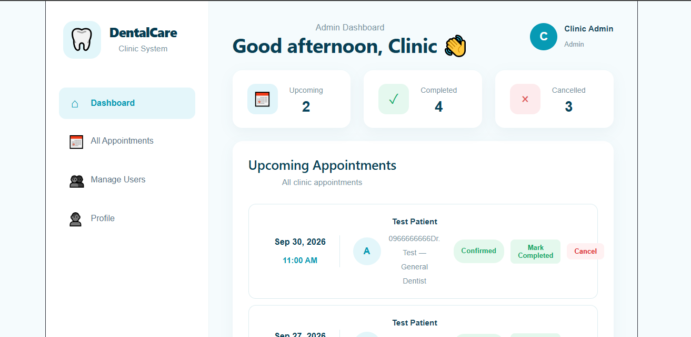
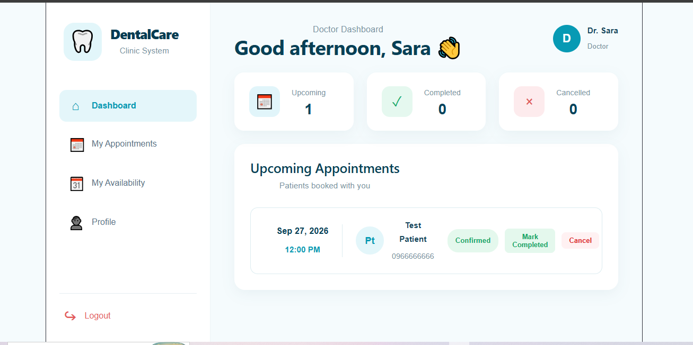
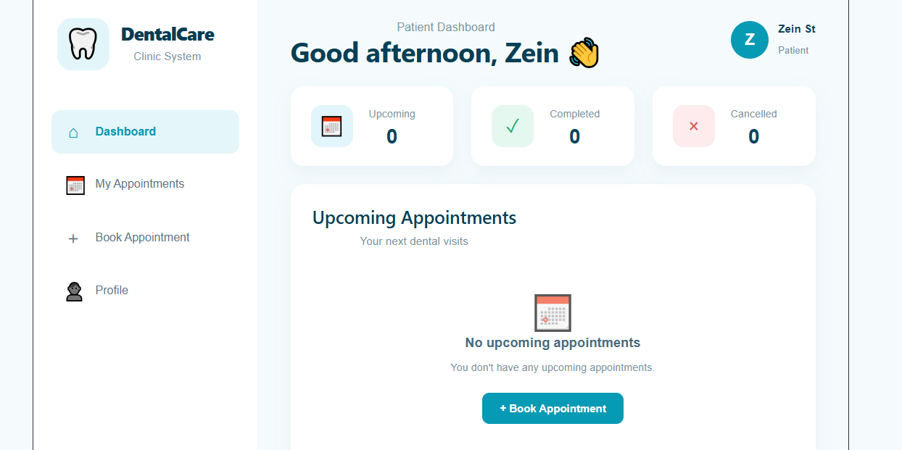
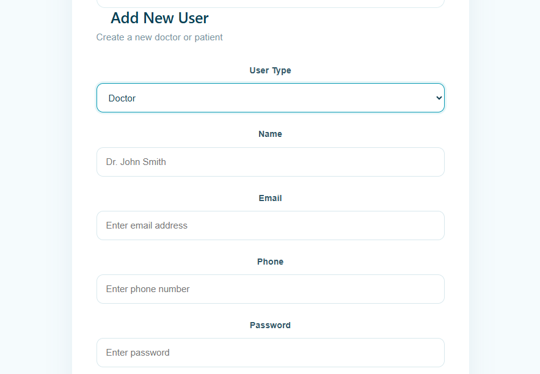
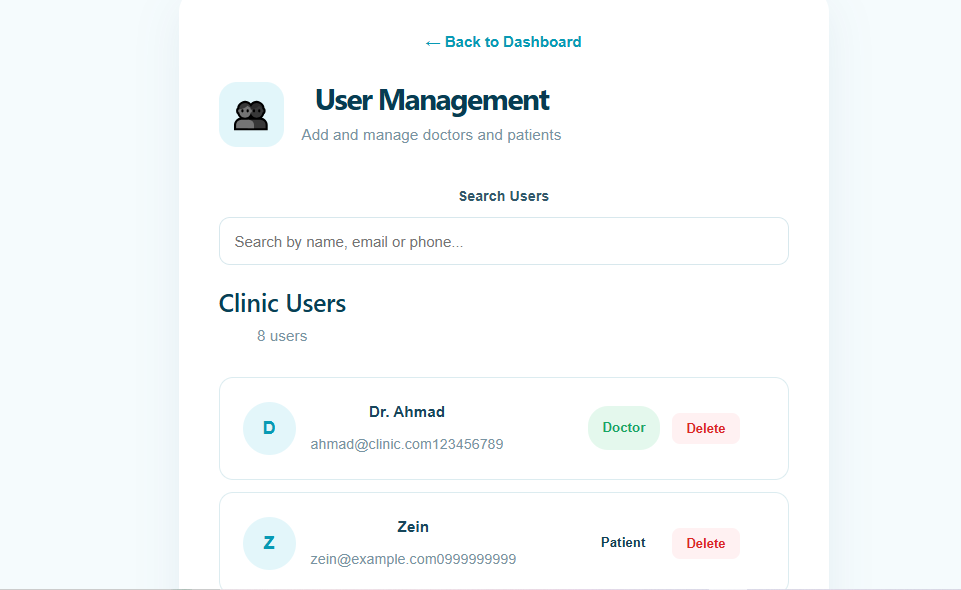
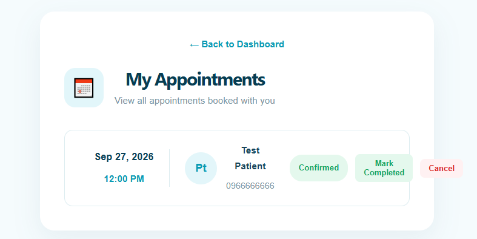

# Dental Clinic Appointment System 🦷

A full-stack dental clinic appointment management system built with ASP.NET Core Web API, SQL Server, Entity Framework Core, JWT Authentication, and React.

## 📌 Project Overview

This project is designed to manage dental clinic appointments and provide different features based on the user's role.

The system supports three main roles:

- Admin
- Doctor
- Patient

Each role has access to specific features and operations.

## ✨ Features

### 🔐 Authentication & Authorization

- User login with JWT authentication
- Secure password hashing
- Role-based authorization
- Protected API endpoints
- Different permissions for Admin, Doctor, and Patient

### 👨‍⚕️ Doctor Management

- View doctors
- Create doctors
- Assign medical specialties
- Doctor profile
- Doctor availability management
- Prevent overlapping availability schedules

### 🧑‍🦰 Patient Management

- Patient registration
- Patient profile
- View personal appointments
- Book appointments

### 📅 Appointment Management

- Check appointment availability
- Book appointments
- 30-minute appointment duration
- Prevent double booking
- Appointment confirmation
- Cancel appointments
- Complete appointments
- Validate doctor working hours

### 👑 Admin Management

- Manage users
- Create doctors and patients
- View appointments
- Manage doctor specialties
- Manage doctor availability

## 🛠️ Technologies

### Backend

- C#
- ASP.NET Core Web API
- .NET 8
- Entity Framework Core
- SQL Server
- JWT Authentication
- Swagger / OpenAPI

### Frontend

- React
- TypeScript
- Vite
- CSS

### Tools

- Visual Studio
- Visual Studio Code
- Git
- GitHub

## 🏗️ Project Structure

- Controllers
- DTOs
- Data
- Migrations
- Models
- Services
- Properties
- Program.cs
- appsettings.json
- ClinicAppointmentSystem.csproj
- ClinicAppointmentSystem.sln

## 📸 Screenshots

### Login

### Admin Dashboard

### Doctor Dashboard

### Patient Dashboard

### User Management

### User Management - Details

### Doctor Appointments

