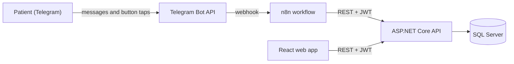

# Dental Clinic Appointment System 🦷

A full-stack dental clinic appointment management system built with **ASP.NET Core Web API**, **SQL Server**, **Entity Framework Core**, **JWT authentication**, and **React**, extended with a **Telegram booking bot** orchestrated by **n8n**.

Clinic staff manage patients, doctors and schedules from the web app. Patients book, view and cancel appointments from Telegram.

> Only patients registered by the clinic can use the bot. A Telegram account is linked to an existing patient through a **verified phone number**, so strangers cannot book and block real doctors' slots.

## 📌 Project Overview

The system supports three main roles, each with its own permissions:

- Admin
- Doctor
- Patient

A fourth, low-privilege `Bot` role is used only by the n8n service account.

## 🏛️ Architecture



- **ASP.NET Core API**: business rules, authentication, authorization and data access.
- **n8n**: the conversation flow (inline keyboards, step-by-step booking). It holds no business logic and only calls the API.
- **React web app**: used by the clinic staff.

## ✨ Features

### 🔐 Authentication & Authorization

- User login with JWT authentication
- Secure password hashing
- Role-based authorization
- Protected API endpoints
- Different permissions for Admin, Doctor, and Patient

### 👨‍⚕️ Doctor Management

- View doctors
- Create doctors
- Assign medical specialties
- Doctor profile
- Doctor availability management
- Prevent overlapping availability schedules

### 🧑‍🦰 Patient Management

- Patients are registered by the clinic (Admin)
- Patient profile
- View personal appointments
- Book appointments

### 📅 Appointment Management

- Check appointment availability
- Book appointments
- 30-minute appointment duration
- Prevent double booking
- Appointment confirmation
- Cancel appointments
- Complete appointments
- Validate doctor working hours
- One active appointment per patient per day

### 👑 Admin Management

- Manage users
- Create doctors and patients
- View appointments
- Manage doctor specialties
- Manage doctor availability

### 🤖 Telegram Booking Bot (n8n)

- Phone verification with Telegram's *share contact* button. The contact must belong to the sender, and it is matched against patients already registered by the clinic.
- Book an appointment: choose a doctor, a day, a time, then confirm. Days and times come from the doctor's real working hours and existing bookings.
- *My appointments* and one-tap cancellation. A patient can only see and cancel their own appointments.
- Friendly messages for failure cases (slot just taken, already booked that day, service unavailable).

## 🛠️ Technologies

### Backend

- C#
- ASP.NET Core Web API
- .NET 8
- Entity Framework Core
- SQL Server
- JWT Authentication
- Swagger / OpenAPI

### Frontend

- React
- TypeScript
- Vite
- CSS

### Automation

- n8n
- Telegram Bot API

### Tools

- Visual Studio
- Visual Studio Code
- Git
- GitHub

## 🔌 API Overview

**Core API** (Swagger is available when running locally)

| Method | Route | Description |
|---|---|---|
| POST | `/api/Users/login` | Log in and receive a JWT |
| GET | `/api/Appointments` | List appointments (scoped by role) |
| POST | `/api/Appointments/check` | Check whether a slot is available |
| POST | `/api/Appointments/confirm` | Create an appointment |
| PUT | `/api/Appointments/cancel/{id}` | Cancel an appointment |
| PUT | `/api/Appointments/complete/{id}` | Mark an appointment as completed |

**Bot API** (`Bot` role only, used by n8n)

| Method | Route | Description |
|---|---|---|
| POST | `/api/bot/link` | Link a Telegram chat to an existing patient by phone number |
| GET | `/api/bot/patients/{telegramChatId}` | Find the patient linked to a chat |
| GET | `/api/bot/doctors` | List doctors |
| GET | `/api/bot/doctors/{doctorId}/available-days` | Next days that still have a free slot |
| GET | `/api/bot/availability?doctorId=&date=` | Free times for a given day |
| POST | `/api/bot/appointments` | Book an appointment |
| GET | `/api/bot/appointments/{telegramChatId}` | Upcoming appointments of the linked patient |
| PUT | `/api/bot/appointments/{id}/cancel` | Cancel an appointment owned by the chat's patient |

## 🏗️ Project Structure

- Controllers
- DTOs
- Data
- Migrations
- Models
- Services
- Properties
- n8n (Telegram bot workflow, sanitized)
- Program.cs
- appsettings.json
- ClinicAppointmentSystem.csproj
- ClinicAppointmentSystem.sln

## 🚀 Running Locally

### 1. API

```bash
# apply migrations
dotnet ef database update

# JWT signing key: never commit it
dotnet user-secrets set "Jwt:Key" "<a random secret of at least 32 characters>"

dotnet run
```

Set your SQL Server connection string in `appsettings.Development.json` (kept out of source control), then open `/swagger`.

Create a service user with the `Bot` role for n8n (an Admin can create it through the users endpoint).

### 2. Telegram bot (n8n)

1. Create a bot with [@BotFather](https://t.me/BotFather) and keep the token private.
2. In n8n, **import** `n8n/clinic-booking-workflow.json`.
3. Create the credentials:
   - **Telegram API**: your bot token (used by the trigger and the message nodes).
   - **Custom Auth** (for the `Login` node):
     ```json
     { "body": { "email": "<bot service user email>", "password": "<its password>" } }
     ```
4. In the `Config` node, set `apiBaseUrl` to your API's public HTTPS URL.
5. In the `Choose Time` node, replace `YOUR_BOT_TOKEN` in the URL with your bot token. (The Telegram node cannot build a variable number of buttons, so this node calls the Bot API directly.)
6. Reassign the Telegram credential on each Telegram node if n8n asks, then activate the workflow.

n8n must reach your API over HTTPS. For local development, use a tunnel such as Cloudflare Tunnel or ngrok.

## 🔒 Security Notes

- No secrets in the repository: the JWT key lives in User Secrets or environment variables, and the exported workflow contains placeholders only.
- The bot authenticates with a dedicated low-privilege `Bot` account.
- Appointment ownership is checked on the server. A request for someone else's appointment returns the same response as a missing one.
- Bot registration is closed: unknown phone numbers are rejected.

## 🗺️ Roadmap

- [ ] Automatic reminders 24 hours before the appointment, with a cancel button
- [ ] Limit on active upcoming appointments per patient
- [ ] Deploy the API (Azure App Service + Azure SQL) with a permanent URL
- [ ] Confirmation step before cancelling from the bot

## 🖼️ Screenshots

<!-- Add: a Telegram conversation, the n8n workflow canvas, the web app -->
